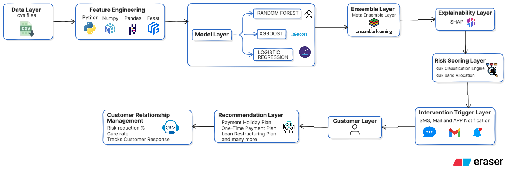
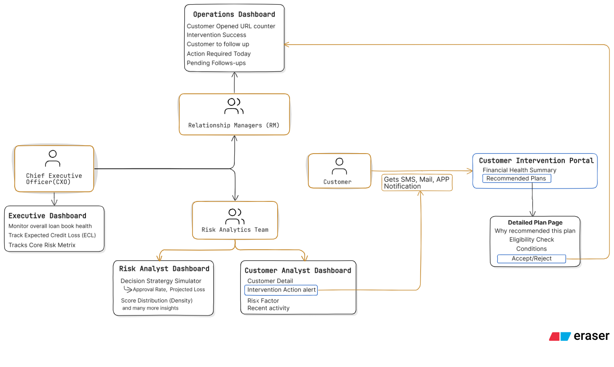

<div align="center">

<br/>

```
 ██████╗██████╗ ███████╗██████╗ ██╗██╗  ██╗
██╔════╝██╔══██╗██╔════╝██╔══██╗██║╚██╗██╔╝
██║     ██████╔╝█████╗  ██║  ██║██║ ╚███╔╝ 
██║     ██╔══██╗██╔══╝  ██║  ██║██║ ██╔██╗ 
╚██████╗██║  ██║███████╗██████╔╝██║██╔╝ ██╗
 ╚═════╝╚═╝  ╚═╝╚══════╝╚═════╝ ╚═╝╚═╝  ╚═╝
```

### **AI-Driven Pre-Delinquency Risk Intelligence Platform**
#### *Predict financial stress before default happens. Intervene before it's too late.*

<br/>

[](https://python.org)
[](https://xgboost.ai)
[](https://lightgbm.readthedocs.io)
[](https://dash.plotly.com)
[](https://mlflow.org)
[](https://feast.dev)
[](https://kafka.apache.org)

<br/>

> **🏆 Hackathon Submission** — Built to solve a $1.7 trillion NPA problem with AI-first banking infrastructure.

<br/>

---

## 📽️ Demo Video

[](https://youtu.be/NvW5ZPBZtVk)
&nbsp;&nbsp;
[](https://github.com/Anuz-bit/CREDIX)

> 👆 *Full end-to-end demo — data pipeline, AI risk scoring, dashboards, and customer intervention portal in action.*

---

</div>

<br/>

## 🧠 The Problem We Solve

<table>
<tr>
<td width="50%">

### ❌ How Banks Work Today
```
Customer misses EMI payment
         ↓
Collections team activated
         ↓
Customer relationship damaged
         ↓
Recovery costs 15–20% of amount
         ↓
NPA recorded. Too late to prevent.
```
Banks are **reactive**. They act on events, not signals.

</td>
<td width="50%">

### ✅ How CREDIX Works
```
Behavioral signals quietly shift
         ↓
AI detects stress 2–4 weeks early
         ↓
Personalized plan offered proactively
         ↓
Customer accepts. Payment made.
         ↓
Zero NPA. Relationship preserved.
```
CREDIX is **predictive**. It acts on signals, not events.

</td>
</tr>
</table>

<div align="center">

> **The core insight:** Salary delays, savings drawdown, failed auto-debits — these signals appear 2–4 weeks before any missed payment. CREDIX listens to them continuously.

</div>

---

<br/>

## 💡 What is CREDIX?

**CREDIX** is an AI-powered pre-delinquency intelligence platform that monitors customer financial behavior in real time, predicts the **Probability of Default (PD) 2–4 weeks before it happens**, and automatically triggers personalized, supportive interventions — transforming banking from *reactive recovery* to *proactive financial care*.

<div align="center">

```
┌──────────────────────────────────────────────────────────────┐
│                                                              │
│   Old risk systems ask  →  "Who already defaulted?"         │
│                                                              │
│   CREDIX asks           →  "Who will struggle next,         │
│                             and how can we help NOW?"        │
│                                                              │
└──────────────────────────────────────────────────────────────┘
```

</div>

---

<br/>

## 🏗️ System Architecture

### 🤖 Layer 1 — AI & Data Pipeline



> **Reading the diagram left to right:**
> Raw CSV data enters the **Data Layer** → Python/NumPy/Pandas/Feast compute behavioral features in the **Feature Engineering Layer** → Three models (Random Forest, XGBoost, Logistic Regression) run in parallel in the **Model Layer** → Their outputs are combined by the **Meta Ensemble Layer** → **SHAP** explains every decision → The **Risk Scoring Engine** assigns a Risk Band → **SMS, Mail, and App notifications** fire automatically → The **Customer** receives a plan via the **Recommendation Layer** → Outcomes feed back into the **CRM Loop**.

---

### 👥 Layer 2 — User, Role & Dashboard Architecture



> **Reading the diagram:**
> The **CXO** monitors portfolio health via the Executive Dashboard. The **Risk Analytics Team** operates two dashboards — the Risk Analyst Dashboard (strategy simulation, score distribution) and the Customer Analyst Dashboard (per-customer risk detail and intervention alerts). **Relationship Managers (RMs)** receive escalated cases and track them in the **Operations Dashboard** (intervention success, follow-up queue, actions required today). Meanwhile, **Customers** receive SMS/Mail/App alerts and flow into the **Customer Intervention Portal** → **Detailed Plan Page** → Accept/Reject — closing the loop back to the Operations Dashboard.

---

<br/>

## 🔁 Complete Flow — Step by Step

### 🤖 AI Pipeline

| Step | Layer | What Happens |
|:---:|:---|:---|
| 1 | **Data Layer** | Raw CSV files ingested — transactions, loans, KYC, credit data |
| 2 | **Feature Engineering** | Python + NumPy + Pandas + Feast compute 55+ behavioral signals with 30/60-day rolling windows — no target leakage |
| 3 | **Model Layer** | Random Forest, XGBoost, and Logistic Regression each produce an independent PD score |
| 4 | **Ensemble Layer** | Meta-learner stacks all three into one optimized Probability of Default |
| 5 | **Explainability** | SHAP breaks down WHY each customer is flagged — which exact signals drove their score |
| 6 | **Risk Scoring** | PD → Risk Band (🟢 Low / 🟡 Moderate / 🟠 High / 🔴 Critical) + trend direction |
| 7 | **Intervention Trigger** | Alert fired via SMS (Twilio), Gmail, App notification based on severity |
| 8 | **Customer Layer** | Customer receives a supportive message with a portal link |
| 9 | **Recommendation Layer** | Payment Holiday / One-Time Plan / Loan Restructuring matched to risk profile |
| 10 | **CRM Loop** | Risk reduction %, cure rate, and customer response tracked → model retrains |

### 👥 User & Dashboard Flow

| Role | Dashboard | Key Information Available |
|:---|:---|:---|
| 👔 **CXO** | Executive Dashboard | Loan book health · Expected Credit Loss (ECL) · Core risk metrics |
| 📊 **Risk Analytics Team** | Risk Analyst Dashboard | Decision Strategy Simulator · Approval rate · Projected loss · Score distribution density |
| 📋 **Risk Analytics Team** | Customer Analyst Dashboard | Customer detail · Intervention action alert · Risk factor breakdown · Recent activity |
| 🤝 **Relationship Managers** | Operations Dashboard | URL open counter · Intervention success rate · Customers to follow up · Action required today · Pending follow-ups |
| 👤 **Customer** | Intervention Portal | Financial Health Summary → Recommended Plans → Detailed Plan (Why this plan · Eligibility · Conditions · Accept/Reject) |

---

<br/>

## ⚡ Key Innovations

<table>
<tr>
<td align="center" width="25%">

### 🔮
**4-Model Ensemble**
Random Forest + XGBoost + Logistic Regression stacked by a Meta-Learner for maximum accuracy and robustness against any single model's blind spots

</td>
<td align="center" width="25%">

### 🧬
**55+ Behavioral Signals**
Salary delay, savings drawdown, credit utilization trend, failed auto-debits, lending app exposure, transaction volatility — with rolling 30/60-day windows

</td>
<td align="center" width="25%">

### 🪙
**Credit Points Gamification**
The only risk platform that *rewards* customers for healthy financial behavior — transforming collections into collaboration

</td>
<td align="center" width="25%">

### 🔄
**Closed-Loop CRM**
Every intervention outcome — cure rate, risk reduction, customer response — feeds back into model retraining. The system gets smarter every day.

</td>
</tr>
</table>

---

<br/>

## 🛠️ Tech Stack

<div align="center">

| Layer | Technology |
|:---|:---|
| **Data Ingestion** | CSV files · Apache Kafka (streaming simulation) · Apache Airflow (orchestration) |
| **Feature Engineering** | Python · Pandas · NumPy · **Feast Feature Store** (offline + online serving) |
| **ML Models** | **XGBoost** · **LightGBM** · **Random Forest** · **Logistic Regression** |
| **Ensemble** | Meta-Learner stacking (OOF predictions → Logistic Regression combiner) |
| **Explainability** | **SHAP** — per-customer feature contribution breakdown |
| **MLOps** | **MLflow** experiment tracking · BentoML model serving |
| **Dashboards** | **Plotly Dash** · Role-based access control · 5 purpose-built views |
| **Alerts** | **Twilio** SMS · **SMTP Email** (Gmail) · In-app push notifications |
| **Access** | ngrok public tunneling for live demo |

</div>

---

<br/>

## 🌍 Real-World Impact

<div align="center">

| Metric | Before CREDIX | With CREDIX |
|:---|:---:|:---:|
| ⏱️ Risk detection lead time | 0 days (post-default) | **14–28 days early** |
| 💸 Collection cost | 15–20% of recovered amount | **Significantly reduced** |
| 🤝 Customer relationship | Damaged post-collection | **Preserved proactively** |
| 📉 30-day delinquency rate | Baseline | **Measurably lower** |
| 🎯 Model accuracy | N/A | **AUC 0.72–0.82 · KS 0.30–0.45** |
| 🧠 Decision explainability | None | **Full SHAP breakdown per customer** |

</div>

---

<br/>

## 🚀 Quick Start

### Prerequisites
```
Python 3.10+  |  Git  |  pip
```

### 1. Clone
```bash
git clone https://github.com/Anuz-bit/CREDIX.git
cd CREDIX
```

### 2. Create Virtual Environment
```bash
# Windows
python -m venv venv
venv\Scripts\activate

# macOS / Linux
python -m venv venv
source venv/bin/activate
```

### 3. Install Dependencies
```bash
pip install -r requirements.txt
```

### 4. Launch Full System
```bash
python start_full_system.py
```

### 5. Open Dashboard
```
http://localhost:8051
```

> ✅ One command launches the complete pipeline: data → features → models → risk scoring → all dashboards live.

---

<br/>

## 🧪 Demo Flow (What Judges Will See)

```
Step 1  →  100K synthetic customers loaded with realistic stress profiles
Step 2  →  55+ behavioral features engineered per customer via Feast
Step 3  →  Random Forest + XGBoost + Logistic Regression train in parallel
Step 4  →  Meta-ensemble stacks outputs → Final Probability of Default score
Step 5  →  SHAP explains WHY each customer is flagged (feature contributions)
Step 6  →  Risk Band assigned: 🟢 Low / 🟡 Moderate / 🟠 High / 🔴 Critical
Step 7  →  High-risk customers receive SMS + Email + App alert automatically
Step 8  →  Customer opens Intervention Portal → sees Financial Health Summary
Step 9  →  Personalized plan recommended (EMI flex / Payment Holiday / Restructure)
Step 10 →  RM picks up case in Operations Dashboard
Step 11 →  Outcome tracked (cure rate, risk %, response) → model retrains
```

---

<br/>

## 🪙 Credit Points — Our Unique Feature

> *No other risk platform in this hackathon does this.*

CREDIX introduces **gamified financial wellness** — customers earn points for responsible behavior, turning the bank-customer dynamic from adversarial (collections) to collaborative (shared financial health goals).

| Action | Points Earned |
|:---|:---:|
| ✅ On-time EMI payment | **+50 pts** |
| ✅ Maintaining healthy savings balance | **+30 pts** |
| ✅ Reducing credit utilization below 50% | **+20 pts** |
| ✅ Engaging with financial health tips | **+10 pts** |
| 🎁 Points redeemable for | Interest rate discounts · Loan top-up eligibility · Reward vouchers |

---

<br/>

## 📁 Project Structure

```
CREDIX/
│
├── 📂 synthetic_data/                # Realistic banking data generator
│   └── generate_data.py              # 100K customers × 6 tables
│
├── 📂 features/                      # Feature engineering pipeline
│   ├── feature_engineering.py        # 55+ signals, rolling 30/60-day windows
│   ├── feature_definitions.py        # Feast feature view definitions
│   └── feature_store_init.py         # Feast offline → online materialization
│
├── 📂 models/                        # ML model training
│   ├── random_forest_model.py        # RF + OOF predictions
│   ├── xgb_model.py                  # XGBoost + OOF predictions
│   ├── logistic_model.py             # Logistic Regression + OOF predictions
│   └── meta_learner.py               # Stacking → Final PD score
│
├── 📂 alert_engine/                  # Intervention logic
│   ├── risk_banding.py               # PD → Risk Band assignment
│   ├── intervention_rules.py         # Plan recommendation engine
│   └── notification_router.py        # SMS / Email / App routing
│
├── 📂 dashboards/                    # Plotly Dash multi-role UI
│   ├── app.py                        # Main app with RBAC
│   ├── executive_dashboard.py        # CXO view
│   ├── risk_analyst_dashboard.py     # Risk team view
│   ├── customer_analyst_dashboard.py # Per-customer detail view
│   ├── operations_dashboard.py       # RM follow-up view
│   └── customer_portal.py            # Customer intervention portal
│
├── 📂 monitoring/                    # Model governance
│   ├── drift_detector.py
│   ├── bias_monitor.py
│   └── audit_logger.py
│
├── 📂 feast_repo/                    # Feature store config
│   ├── feature_store.yaml
│   └── features.py
│
├── 📂 airflow_dags/                  # Pipeline orchestration
│   ├── batch_pipeline_dag.py         # Daily 2AM batch run
│   └── retraining_dag.py             # Drift-triggered retraining
│
├── Architeture.png                   # AI pipeline architecture diagram
├── diagram-export-*.png              # Dashboard & user flow diagram
├── start_full_system.py              # ← Run everything in one command
└── requirements.txt
```

---

<br/>

## 🏆 Why CREDIX Stands Out

<div align="center">

| Dimension | Typical Risk Tool | CREDIX |
|:---|:---:|:---:|
| Detects risk before default | ❌ | ✅ 2–4 weeks early |
| Explainable per-customer decisions | ❌ Black box | ✅ SHAP breakdown |
| Customer-facing self-service portal | ❌ | ✅ Accept/Reject plans |
| Gamified financial engagement | ❌ | ✅ Credit Points system |
| Closed-loop outcome learning | ❌ | ✅ CRM → model retraining |
| Role-specific multi-dashboards | ❌ | ✅ 5 purpose-built views |
| RM workflow & follow-up tracker | ❌ | ✅ Operations dashboard |
| Real-time + batch pipeline | ❌ | ✅ Kafka + Airflow |

</div>

<br/>

<div align="center">

```
┌─────────────────────────────────────────────────────────┐
│                                                         │
│   Most risk systems exist to protect banks.             │
│                                                         │
│   CREDIX protects both banks AND customers.             │
│                                                         │
└─────────────────────────────────────────────────────────┘
```

</div>

---

<br/>

## 🔮 Future Roadmap

- [ ] 🏦 Live Core Banking API integration (Finacle / Temenos / RBI Account Aggregator framework)
- [ ] 🤖 Reinforcement Learning for adaptive intervention optimization
- [ ] ☁️ Production AWS deployment (SageMaker · Kinesis · DynamoDB · QuickSight)
- [ ] 📱 Customer mobile app for real-time financial health tracking
- [ ] 🌐 Multi-bank portfolio simulation at scale (1M+ customers)
- [ ] 🧠 PyTorch LSTM for deep behavioral sequence modeling

---

<br/>

## 👥 Team

<div align="center">

**Built as a FinTech AI innovation project** focused on solving real-world credit risk challenges through explainable, customer-centric machine learning.

*Hackathon Submission — AI in Banking / FinTech Track*

</div>

---

<br/>

<div align="center">

**CREDIX** — *Turning financial stress signals into second chances.*

<br/>

[](https://github.com/Anuz-bit/CREDIX)
&nbsp;&nbsp;
[](https://github.com/Anuz-bit/CREDIX/fork)
&nbsp;&nbsp;
[](https://github.com/Anuz-bit/CREDIX)

<br/>

*If CREDIX impressed you — drop a ⭐ and share it.*

</div>
